VINOH Indoor Navigation Objects and Hierarchies
===============================================

**it.isti.cnr.wnlab.indoornavigation** package documentation
*Written on 5th May 2017 by Michele Agostini (agomik@gmail.com)*

> This documentation comes with related code and this is basically an how-to work with this. It can be useful, for some basic concepts, to look at the slides or thesis.

## The name
VINOH is a recursive acronym which means VINOH Indoor Navigation Objects and Hierarchies. It's a *beautiful* name, isn't it?

## What is VINOH
*VINOH Indoor Navigation Objects and Hierarchies* is an extensible software architecture supposed to implement utilities for Indoor Location.
For now, VINOH is composed by:
* Java platform-independent basic interfaces and implementations (complete and partial)
* Android platform-dependent utilities for data management and abstraction
> It's useful to limit platform-dependent code to data management and implement the algorithms and strategies in Java or C.
> *Actually this concept is not fully applied because of Android-specific compass and step detection implementations, which are not portable. Please, forgive me for this.*
* An Android app that provides:
 * A Service that implements some simple indoor navigation strategies.
 * An Activity for controlling the service that includes a button for position logging.
> This provides only offline configuration, but it could have been useful to have online configuration too.
> Luckily, all the methods are ready to be used and you just have to implement the service control functions (and test this things).
 * An Activity, whose icon is *FingerFood*, that can be used for fingerprint map in-device realization (from the acquisition to the .csv file creation). See the traineeship report for the CSV output format (or just peek at the existing file).
 * An Activity for graphical Compass debugging. This provides a simple animated compass drawing.
 * An Activity for graphical Step Detection debugging. This contains a coloured rectangle that changes color at each step.

## The Concept
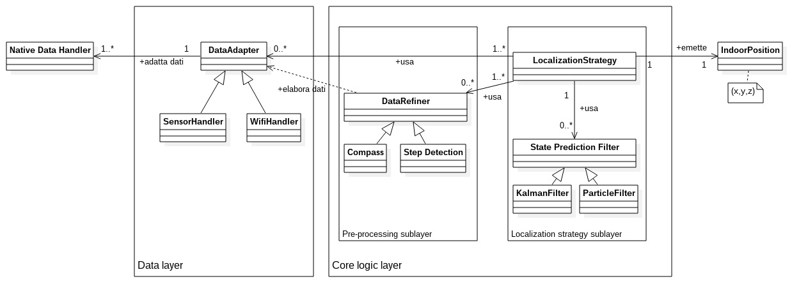
VINOH is an architecture that decuples the algorithms composing an indoor location strategy, which are usually a lot.
* **Data layer**. The *data part* is the only platform-dependent. The modules in here have to adapt the incoming data from the system into VINOH data types.
* **Logic layer**. This layer *should* be platform-independent and manages data to get information and eventually a position.

## Implementation details

### About dependencies and connections
Every component implementation follows this two rules:
1. Every module that emits data accepts one or more **observers**. Every module **has the responsibility of registering its own observers** (that can be anonymous inner classes/functions since Java 8 is now supported by the Android Framework).
> How the modules register to others in the case of a location strategy based on PDR.
> 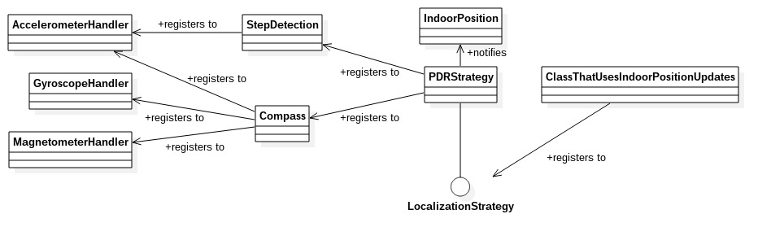
2. Every module **expose its dependencies in the constructor**. These are **injected** by a third component.
> Dependency injection example:
> 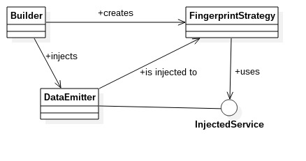

### Data layer
The purpose of the data layer is to make the location algorithms' code independent from the system. This layer is made of all the components, which are usually handlers, that adapt incoming data and notify their observers with new immutable data objects. Probably the code written explains this concept better than I can do in human words.
> Probably these modules will have to register to some listeners or read data streams.

> ***Android platform***: the components that form an *Android data layer* are handlers that register a SensorListener and create data objects from the specific sensor-formatted *values* array. See this page for details about the Android platform: https://developer.android.com/reference/android/hardware/SensorManager.html
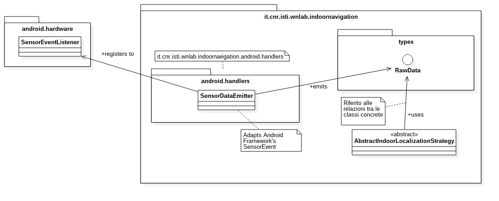

#### Indoor maps
I made some abstractions for maps of indoor locations. I just made the minimum for my needs, so I guess it could be made better.

### Core logic layer
Here are logically put all other modules. This layer should remain platform independent.

## The architecture (hierarchies and some relations)
The implementation is distributed over three layers:
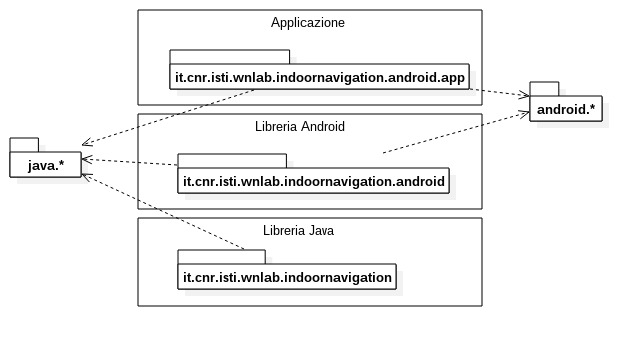
The following diagrams cover all the classes the whole thing is made of.

### Observers and emitters
This is the observers' hierarchy.
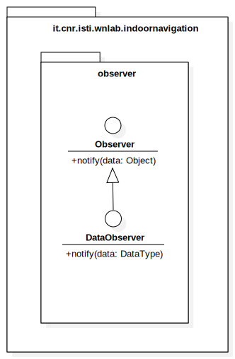
Thanks to generics, these two interfaces cover all the following *emitter* classes.
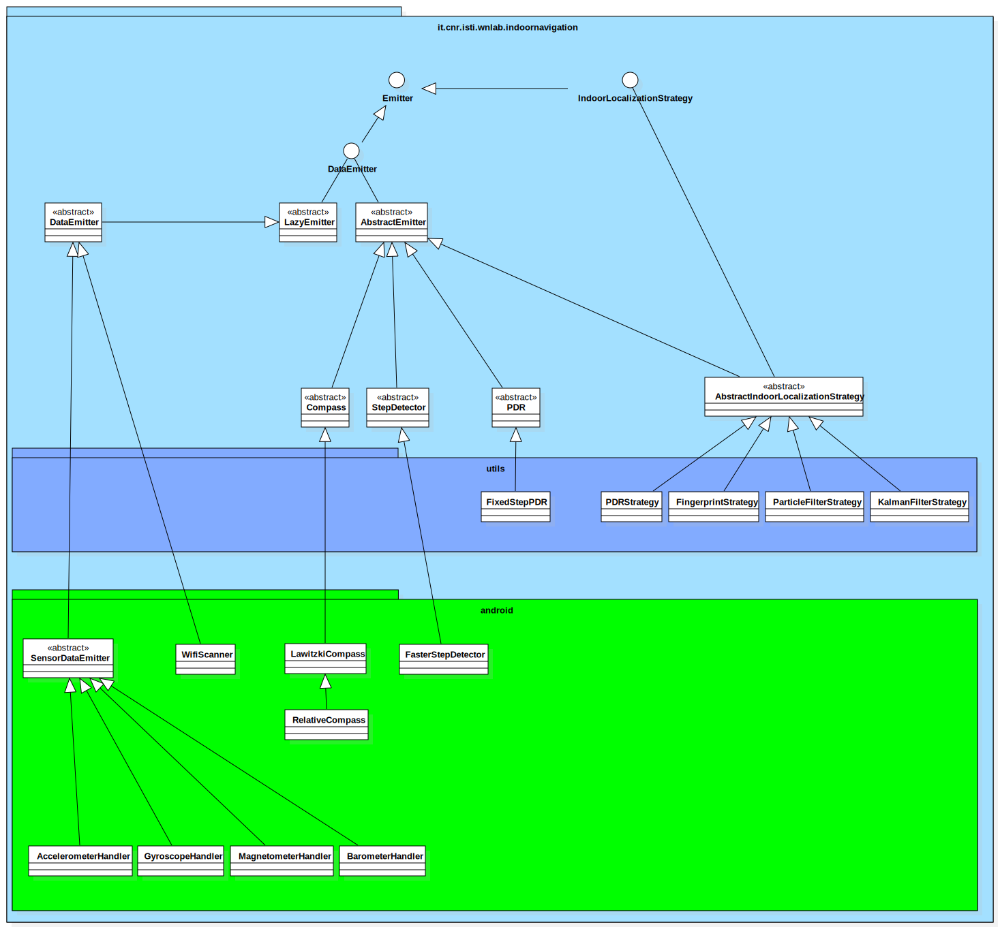

### Position representation
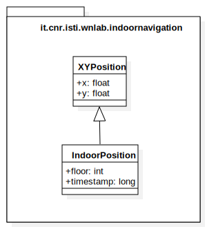

### Data types
These data types allow independency from the system.
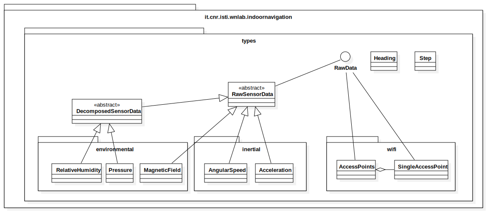
All are **immutable** and **serializable**.

### State Estimation Filters
Kalman and Particle filters are both state estimation filters. However, be careful that in this implementation KF's state represents an **error correction** while PF's represents a **position** (more or less).
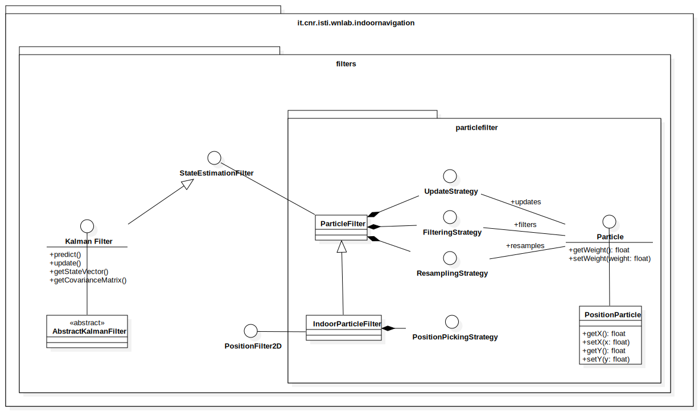
> Note that if you have to implement a Kalman Filter variant you have to extend KalmanFilter interface or AbstractKalmanFilter class, but if you want to implement a new Particle Filter you'll probably want to just make new Update/Filtering/Resampling strategies.

### PDR
Just extend PDR abstract class if you want to implement one.
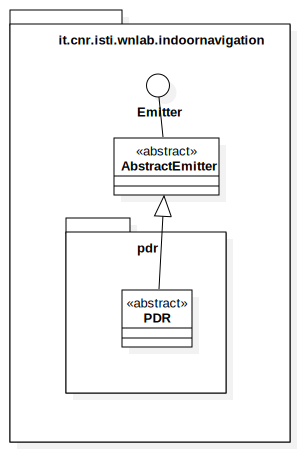

### Fingerprint maps
> Here the word *distance* means the euclidean distance between an *online* fingerprint measurement and the values in the pre-loaded map.

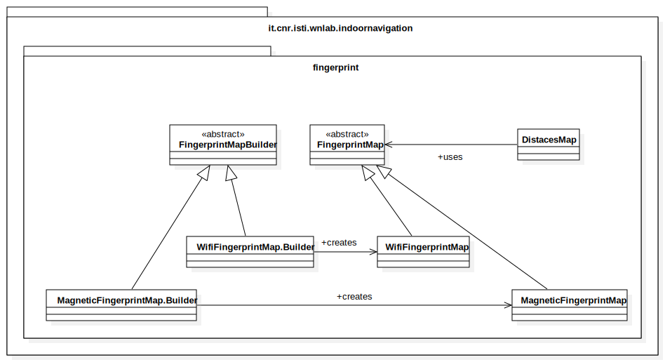

Every FingerprintMap has its own factory that has the responsibility to create an instance of it, for example reading a CSV file.
The *DistancesMap* class is something like a lazy cache for distance updates. It is used in the Particle Filter location strategy.

### Map
> This maps aren't related to the Fingeprint Map concept. Here we are talking about geographical maps representing the area we're locating on.

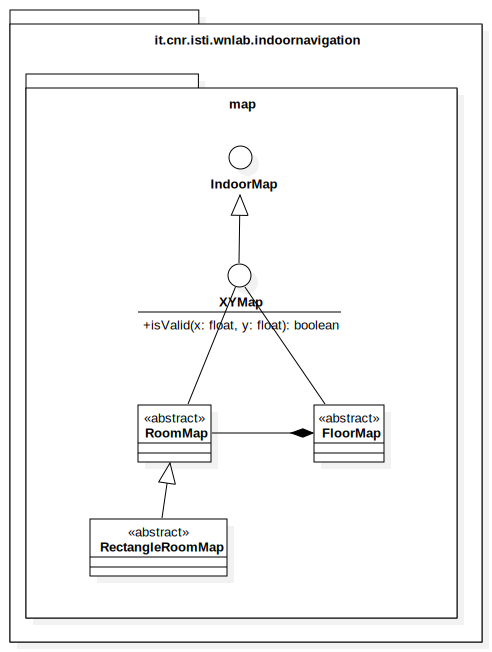

Actually these are simple and not-too-reasoned implementations that consists in a framework of what I strictly needed for my project. Perhaps it has to be redesigned or at least extended.

### Some logging utilities
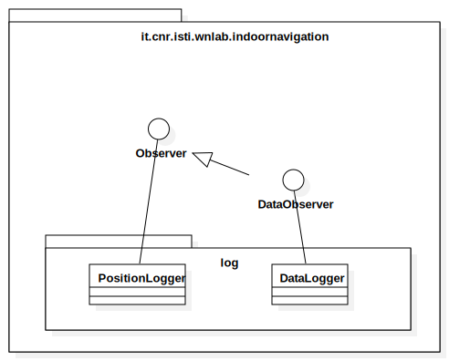
These classes are both an example of how an (data)observer works and useful implementations (I've barely used).

## How to make a new component
Generally speaking, you should make a Java class that:
1. **extends** or **implements** another abstraction that is already in the project. If this doesn't exist, you should firstly create the interfaces and write the common code (if any) in an abstract class, then implement your solution in a concrete class.
2. **receives the data emitters in the constructor** from a third class and manages these emitters in its internal code.
> OOP speaking, a component **HAS its observer** objects/functions and usually **IS NOT an observer**.

## How to make a new component with C/C++
> Remember that is a best practice in Android programming to **write Java code when possible** and **write C/C\++ code only when it is STRICTLY necessary**.
If your algorithm implementation is written in C/C\++ (i.e. for Android native implementations) you can extend the architecture with a class that respects the principles of this architecture and wraps the marshalling operations. So everything remains *clean*.

## The mistery of *.android.graphics* package
This is a work-in-progress package: it contains some code about possible *drawable* classes for output visualization on Android. Unfortunately I have never tested nor even run it.

## JavaDoc
See the [reference](javadoc/index.html) for more details.